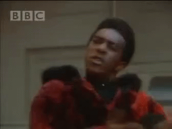
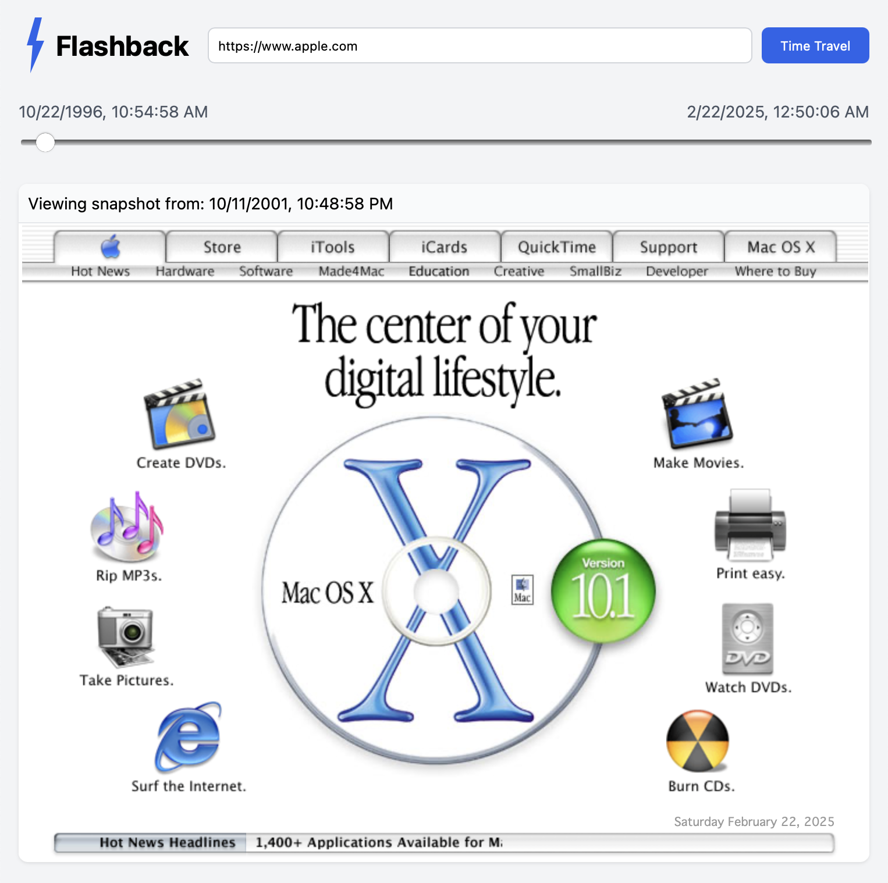

# ⚡️ Flashback
Quickly compare webpage snapshots over time

## What is it?
A single-page web app that aims to present a useful and user-friendly front end to the Internet Archive's `memento` store and the Wayback Machine.

## Ok, but what is it?
Right now it's a proof-of-concept implementation in Javascript, HTML, and CSS to provide a portal into which one can scry for changes to the webpage of their choosing, first by submitting a URL, then scrubbing a slider back and forth through time.

## What does it look like?
Ah, that's a different question altogether. It has a simple interface that looks like this:

## Cool, but it's slow
That's not a question. But you're right. A less naïve implementation would render all the snapshots to canvas and swap through them in memory.

## Great, but why doesn't it do X
Because I made it to solve a specific need, in a short period of time. File an issue with your request, or, better yet, a PR with your changes.

## TODO
 * Make it snappy. 🫡
 * Make resource loading robust across snapshots 🗺️
 * Support other `memento` providers besides the Internet Archive (see [RFC 7809](https://mementoweb.org/guide/rfc/)) 🧑‍💻

## If you like this project
If you think this is useful, thanks! I appreciate it. I think it's useful too. Please show your support by [donating to the Internet Archive](https://archive.org/donate), without which we would literally have lost decades of digital culture (and without whose shoulders this project would have nothing to stand upon).
